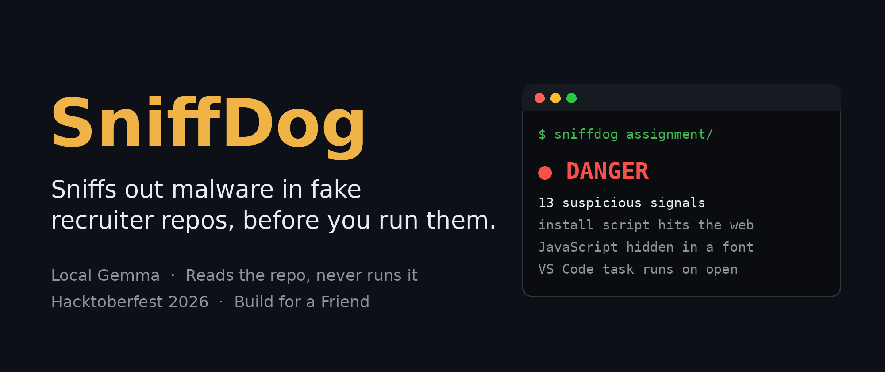
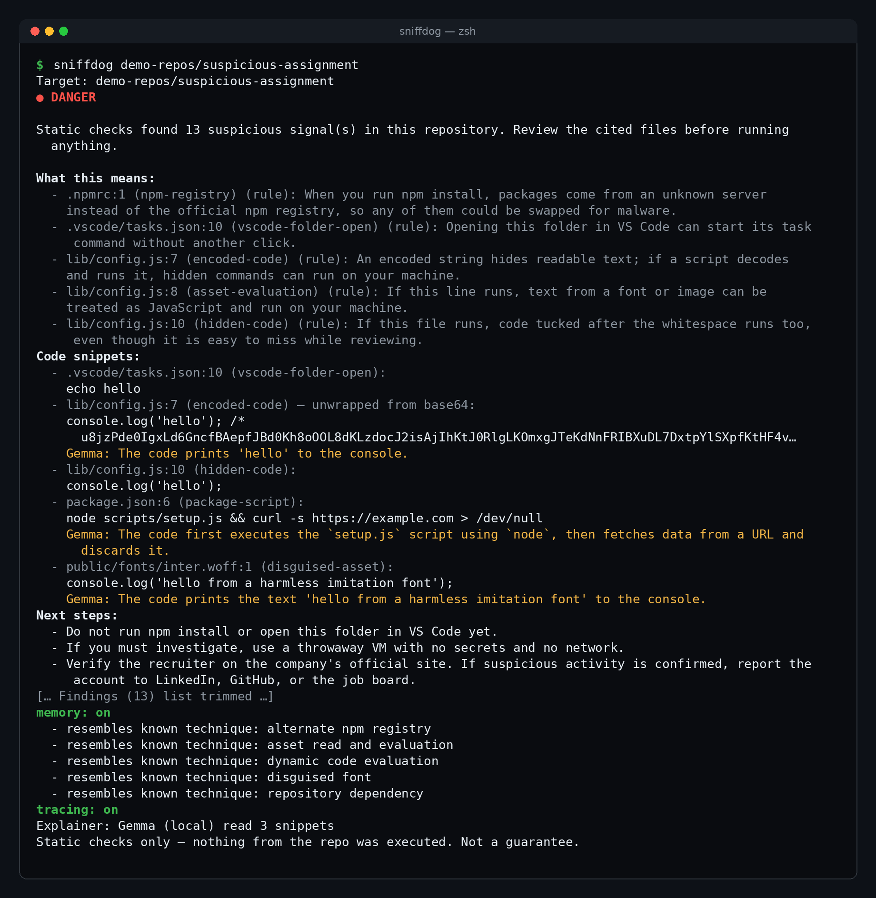
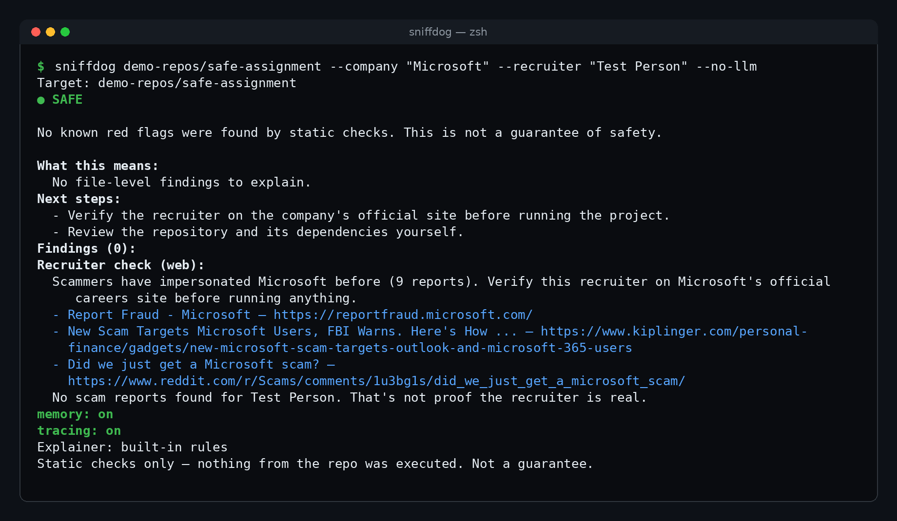
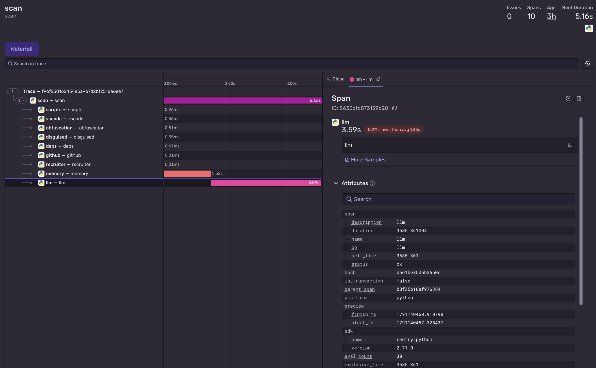
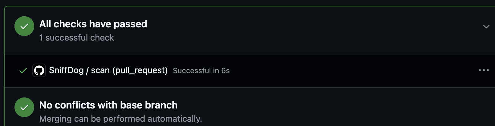

# SniffDog

Review coding assignment repositories before you run them.



[](https://github.com/Anand-240/sniffdog/actions/workflows/sniffdog.yml) [](LICENSE) 

Demo video: [Watch SniffDog](https://youtu.be/1zoa5F4wANQ) | DEV post: [Read the DEV post](https://dev.to/anand240/sniffdog-i-built-my-job-hunting-friend-a-sniffer-dog-that-sniffs-out-malware-in-fake-recruiter-355m)

## Why this exists

Fake recruiters send take-home repositories that hide malware. [Microsoft](https://www.microsoft.com/en-us/security/blog/2026/03/11/contagious-interview-malware-delivered-through-fake-developer-job-interviews/) and [Elastic Security Labs](https://www.elastic.co/security-labs/contagious-interview-malware-svg-steganography) have documented this Contagious Interview tactic. A trap may start during `npm install`, when a folder opens in VS Code, or when the developer starts the app. SniffDog reads the repository before those steps and does not run its code. It was built for a friend who got hit by one of these fake assignments.

## What it looks like



The harmless suspicious demo triggers 13 findings, with file locations, rule explanations, and selected code snippets.



The safe demo has zero findings; public recruiter search results appear separately from its verdict.

## Quick start

Install Python 3.12 or newer and [Ollama](https://ollama.com/download) on macOS or Linux. Start Ollama, then run:

```sh
ollama pull gemma3:1b
ollama pull nomic-embed-text
git clone https://github.com/Anand-240/sniffdog.git
cd sniffdog
python3 -m venv .venv
source .venv/bin/activate
pip install -e .
sniffdog demo-repos/suspicious-assignment
```

For optional Atlas memory and Sentry tracing, install their extras:

```sh
pip install -e ".[memory,tracing]"
```

The embedding model is used by Atlas memory. Gemma describes selected code snippets. Without Ollama, SniffDog uses its built-in rule explanations.

## Usage

| Command | What it does |
| --- | --- |
| `sniffdog https://github.com/owner/repo` | Shallow-clones and scans a plain HTTPS repository URL. |
| `sniffdog ./assignment` | Scans a local folder. |
| `sniffdog ./assignment --company "Example Co"` | Adds public company search context when SerpApi is configured. |
| `sniffdog ./assignment --recruiter "Jane Doe"` | Adds public recruiter search context when SerpApi is configured. |
| `sniffdog ./assignment --lang hinglish` | Uses a Hinglish summary and next steps, and asks Gemma for Hinglish. |
| `sniffdog ./assignment --no-llm` | Skips Gemma and uses rule explanations. |
| `sniffdog ./assignment --json` | Prints the scan as JSON. |
| `sniffdog . --no-llm --exclude demo-repos --exclude .kilo` | Skips both relative directory prefixes. Repeat `--exclude` as needed; globs are not supported. |
| `sniffdog seed` | Adds known technique patterns to configured Atlas memory. |

| Exit code | Meaning |
| --- | --- |
| 0 | SAFE |
| 1 | CAUTION |
| 2 | DANGER |
| 3 | The repository could not be fetched or read |

## What it checks

These are the file scanner rules. A finding points to the file and line when available.

| Check | Example | Why it matters |
| --- | --- | --- |
| `package-script` | An npm lifecycle script or risky `start` command | Package commands can run during install, packaging, or a manual script. |
| `vscode-folder-open` | A task with `runOn: folderOpen` | Opening the folder can start a command. |
| `vscode-auto-tasks` | `task.allowAutomaticTasks: on` | VS Code may allow tasks to start automatically. |
| `obfuscated-names` | Several `_0x1234` style names | Random-looking names make code harder to review. |
| `encoded-code` | A long Base64 string or hex escapes | Encoded text can conceal readable code. |
| `dynamic-evaluation` | `eval(...)` or `new Function(...)` | Text can be treated as JavaScript. |
| `process-execution` | `child_process`, `execSync`, or `spawn` | Code can start another program or shell command. |
| `raw-ip-url` | A URL with a numeric IP address | The destination is harder to recognize. |
| `hidden-code` | Code after a long run of spaces | A reviewer can miss the trailing code. |
| `long-line` | A JavaScript line over 5,000 characters | Commands can be hard to spot in one line. |
| `disguised-asset` | JavaScript text in a `.woff` file | A font or image name may hide code or an invalid asset. |
| `svg-trailing-code` | Text after `</svg>` | An image file can contain extra content. |
| `svg-script` | A `<script>` tag inside SVG | Some viewers may run embedded JavaScript. |
| `svg-base64` | A long encoded string in SVG | Encoded content is hard to inspect by eye. |
| `asset-evaluation` | Reading a font, then calling `eval` | Asset text may be run as code. |
| `committed-node-modules` | A root `node_modules/` directory | Present dependency files need review too. |
| `npm-registry` | A custom registry in `.npmrc` | Packages can come from a different server. |
| `remote-dependency` | A Git, URL, or local-path package | A dependency may come from outside the npm registry. |
| `typosquat` | `expres` beside `express` | A near-match name may install the wrong package. |
| `lockfile-source` | A lockfile URL outside the npm registry | The resolved package may come from another server. |

## How it works

```text
Local folder or HTTPS URL
  -> guarded shallow clone for URLs
  -> file rules and optional GitHub metadata checks
  -> SAFE, CAUTION, or DANGER
  -> fixed consequences and optional Gemma code descriptions
  -> optional Atlas notes, SerpApi web context, and Sentry timings
```

Deterministic rules decide the verdict; Gemma only reads selected code snippets and cannot lower it. High-severity findings produce DANGER. Medium-severity findings produce CAUTION when no high finding exists. Other results are SAFE.

For encoded-code findings, SniffDog may unwrap Base64 or hex escapes as data. It never executes the decoded text, limits it to 4 KB of mostly printable output, and shows about 120 characters. Remote clones accept plain HTTPS repository URLs and use a shallow clone with hooks disabled, symlinks disabled, other Git protocols blocked, prompts disabled, and Git LFS smudging skipped.

## Optional integrations

### Gemma via Ollama

`OLLAMA_HOST` defaults to `http://localhost:11434`; `OLLAMA_MODEL` defaults to `gemma3:1b`. Gemma reads selected code snippets through the local Ollama host. Atlas memory separately uses local Ollama embeddings of finding evidence. If Ollama is unavailable, rule explanations still work. Use `--no-llm` to skip Gemma.

### MongoDB Atlas memory

Set `MONGODB_URI` and install the `memory` extra to enable prior-scan notes and known-technique matches. Pull `nomic-embed-text`, create a Vector Search index named `pattern_index` in database `sniffdog`, collection `patterns`, then run `sniffdog seed`. The index definition is:

```json
{
  "fields": [
    {
      "type": "vector",
      "path": "embedding",
      "numDimensions": 768,
      "similarity": "cosine"
    }
  ]
}
```

Without `MONGODB_URI`, the report says `memory: off`. Memory stores repository URLs, commit hashes, verdicts, and rule names for previous scans, not scanned source code. It also stores the harmless examples from `patterns/known_patterns.json`.

### Sentry tracing

Set `SENTRY_DSN` and install the `tracing` extra to send span names, timing, status, and numeric counts. The SDK has default and automatic integrations disabled. SniffDog strips source text, prompts, finding text, and query text, then flushes before the CLI exits. Without a DSN, the report says `tracing: off`. Set `SENTRY_DEBUG=1` for SDK diagnostics.



The local Gemma call takes 3.59 s of a 5.16 s scan.

### SerpApi recruiter check

Set `SERPAPI_API_KEY` to look up public reports for a supplied company or recruiter name. Results appear under `Recruiter check (web)` and never change the verdict. If a name is supplied but the key is unset, the section says the search is unavailable.

### GitHub API

For GitHub URLs, SniffDog requests public owner and repository metadata. Those deterministic metadata findings can affect the verdict. `GITHUB_TOKEN` is optional and can raise API rate limits. Without it, requests are unauthenticated; if metadata is unavailable, the file scan still runs.

You can keep optional settings in a local `.env` file. SniffDog does not load it automatically. Leave unused values empty:

```dotenv
MONGODB_URI=
SENTRY_DSN=
SENTRY_DEBUG=
SERPAPI_API_KEY=
GITHUB_TOKEN=
# OLLAMA_HOST defaults to http://localhost:11434
# OLLAMA_MODEL defaults to gemma3:1b
```

## Use it in CI

[The workflow](.github/workflows/sniffdog.yml) runs on pull requests that change package files, `.npmrc`, or VS Code task settings. It installs this package, runs the unit tests, then runs `sniffdog . --no-llm --json --exclude demo-repos`. It writes a verdict and finding count to the GitHub Actions step summary. DANGER fails the job; SAFE and CAUTION do not.

To use it in another repository, copy the workflow and adapt its install step, test command, path triggers, and excluded directories. Its current `pip install .` step works because SniffDog lives in this repository.



The pull request check passed after running tests and the deterministic scan.

## Results

These scans were run against the harmless demos and the named public repositories. Public repositories may change.

| Repository | Verdict | Findings |
| --- | --- | --- |
| `demo-repos/suspicious-assignment` | DANGER | 13 of 13 planted signals |
| `demo-repos/safe-assignment` | SAFE | 0 |
| [MDN todo-react](https://github.com/mdn/todo-react) | SAFE | 0 |
| [MDN Express Local Library](https://github.com/mdn/express-locallibrary-tutorial) | SAFE | 0 |
| [Express generator](https://github.com/expressjs/generator) | CAUTION | 2 medium `process-execution` findings in test files |

The Express generator finding is kept because test files can use `child_process`, and an assignment may ask you to run `npm test`. Read the cited lines before acting on CAUTION.

## Running the tests

```sh
python3 -m unittest discover -s tests -v
```

The current suite has 17 tests.

## Project structure

```text
pyproject.toml                     # Package metadata and optional extras
.env.example                       # Optional environment variable names
sniffdog/
  cli.py                           # Command-line entry point and scan flow
  clone.py                         # Guarded HTTPS clone
  common.py                        # Findings and file walking
  scanner/
    scripts.py                     # Package script checks
    vscode.py                      # VS Code task checks
    obfuscation.py                 # JavaScript and TypeScript checks
    disguised.py                   # Image, font, and SVG checks
    deps.py                        # Dependency source checks
  verdict.py                       # Rule verdicts, consequences, and local Gemma
  report.py                        # Text report
  github_info.py                   # Public GitHub metadata
  recruiter.py                     # SerpApi web context
  memory.py                        # Atlas notes and pattern matching
  tracing.py                       # Sentry spans
patterns/known_patterns.json       # Harmless known-technique examples
demo-repos/                         # Harmless sample repositories
tests/test_core.py                  # Unit tests
.github/workflows/sniffdog.yml     # Pull request scan
docs/images/                       # README screenshots
LICENSE                            # MIT license
```

## Limitations

SniffDog uses static checks. It is not an antivirus, and SAFE is not a guarantee. It can miss new tricks or flag legitimate code. Gemma can omit or misdescribe an action, so compare its sentence with the snippet. [Socket](https://socket.dev/) and [Datadog GuardDog](https://github.com/DataDog/guarddog) go deeper on npm packages.

## About the demo repos

`demo-repos/suspicious-assignment` is harmless. Its scripts and files imitate attack techniques for testing. Scan it, but never run `npm install` or its scripts.

## License

[MIT](LICENSE).
